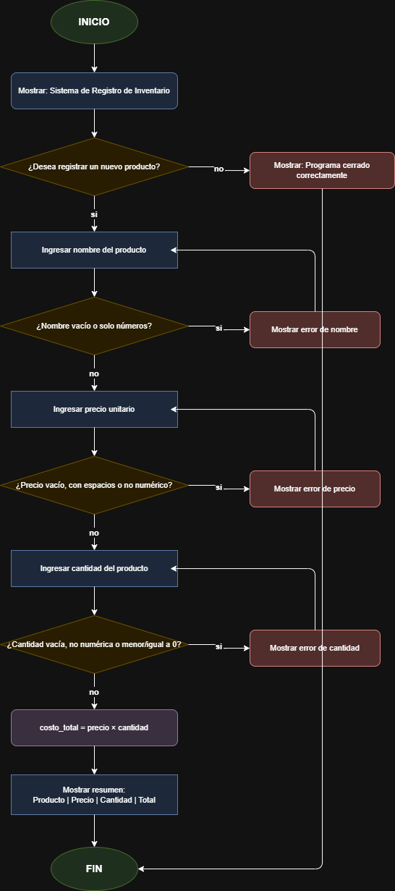

# Registro de Inventario

Un programa sencillo hecho en Python que te permite registrar un producto con su nombre, precio y cantidad, y te dice cuánto cuesta en total.
---

## Equipo

| Nombre |
|---|
| Sharick Olmos |
| Cristian Ortiz |
| Jaime Garcia |

---

## ¿Qué hace este programa?

1. Te pregunta el **nombre** del producto.
2. Te pregunta el **precio** por unidad.
3. Te pregunta la **cantidad** que tienes.
4. Calcula el **costo total** (precio × cantidad).
5. Muestra un resumen con toda la información.

Si escribes algo que no es un número donde se necesita, el programa te avisa y te vuelve a pedir el dato. 

---

## ¿Qué necesito para ejecutarlo?

Solo necesitas tener **Python 3** instalado en tu computadora.

Puedes verificarlo abriendo la terminal y escribiendo:

```bash
python --version
```

Si aparece algo como `Python 3.x.x`, ¡ya estás listo!

---

## ¿Cómo se ejecuta?

1. Abre una terminal en la carpeta donde está el archivo.
2. Escribe este comando y presiona Enter:

```bash
python inventario.py
```

---

## Ejemplo de uso

Esto es lo que verás cuando ejecutes el programa:

```
Ingrese el nombre del producto: Lápiz
Ingrese el precio unitario: 500
Ingrese la cantidad: 3
```

Y el programa te mostrará:

```
Producto: Lápiz | Precio: 500 | Cantidad: 3 | Total: 1500
```

---

## ¿Qué pasa si escribo algo incorrecto?

Si en el precio o cantidad escribes letras en vez de números, el programa te lo dirá y te pedirá que lo escribas de nuevo:

```
Ingrese el precio unitario: abc
Valor inválido. Por favor ingresa un número.
Ingrese el precio unitario:
```

---

## ¿Qué archivos tiene el proyecto?

```
inventario.py                                 | El programa principal (aquí está todo el código)
README.md                               | Este archivo, explica cómo funciona el proyecto
diagrama_inventario_drawio.png | Este archivo muestra el diagrama de flujo del programa
```

---

## ¿Cómo funciona por dentro?

El programa sigue estos pasos en orden:




---
### Link al repositorio: [SystemInvertory](https://github.com/JaimeGar99-del/SistemaDeInvetario)

---
> 💡 **Nota:** Este proyecto fue desarrollado como práctica de fundamentos de programación en Python.