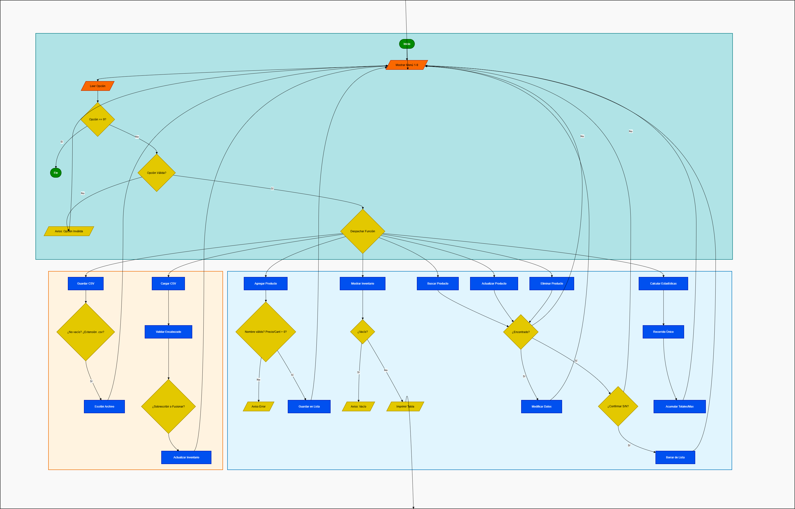

# Sistema de Registro de Inventario

Sistema de gestión de inventario en consola desarrollado en Python. Permite registrar, consultar, actualizar y eliminar productos, calcular estadísticas del stock, y guardar o cargar datos desde archivos CSV.

---

## Estructura del proyecto

```
inventario/
├── app.py          # Menú principal y bucle de control
├── servicios.py    # Operaciones CRUD y estadísticas
└── archivos.py     # Persistencia: guardar y cargar CSV
```

---

## Requisitos

- Python 3.6 o superior
- No requiere dependencias externas (solo librería estándar)

---

## Cómo ejecutar

```bash
python app.py
```

Al iniciar, se muestra el menú principal con las siguientes opciones:

```
SISTEMA DE REGISTRO DE INVENTARIO

¿Que accion desea realizar?
  1. Agregar producto
  2. Mostrar inventario
  3. Buscar producto
  4. Actualizar producto
  5. Eliminar producto
  6. Calcular estadisticas
  7. Guardar CSV
  8. Cargar CSV
  9. Salir
```

---

## Funcionalidades

### 1. Agregar producto
Solicita nombre, precio unitario y cantidad. Valida que el nombre no sea vacío ni puramente numérico, y que precio y cantidad sean valores positivos mayores a cero.

### 2. Mostrar inventario
Lista todos los productos registrados en memoria con su nombre, precio y cantidad. Si el inventario está vacío, informa al usuario.

### 3. Buscar producto
Busca un producto por nombre (sin distinción de mayúsculas/minúsculas) e imprime su información si existe.

### 4. Actualizar producto
Permite modificar el precio y/o la cantidad de un producto existente. Presionar Enter sin escribir nada deja el campo sin cambios.

### 5. Eliminar producto
Elimina un producto del inventario tras pedir confirmación explícita al usuario (S/N).

### 6. Calcular estadísticas
Muestra un resumen del inventario:
- Total de productos registrados
- Unidades totales en stock
- Valor total del inventario (precio × cantidad)
- Producto más caro
- Producto con mayor stock

### 7. Guardar CSV
Guarda el inventario actual en un archivo `.csv` con encabezado `nombre,precio,cantidad`. Si no se especifica ruta, usa `inventario.csv` por defecto.

### 8. Cargar CSV
Carga productos desde un archivo `.csv`. Valida el formato fila por fila y ofrece dos modos:
- **Sobrescribir:** reemplaza el inventario actual completamente.
- **Fusionar:** suma cantidades de productos existentes y agrega los nuevos.

---

## Formato del archivo CSV

```csv
nombre,precio,cantidad
Manzana,1500,100
Leche,3200,50
Pan,800,200
```

Reglas:
- El encabezado debe ser exactamente `nombre,precio,cantidad`
- Precio debe ser un número positivo (acepta decimales)
- Cantidad debe ser un entero positivo
- Las filas con formato inválido se omiten con un aviso; no detienen la carga

---

## Estructura de datos

El inventario se representa como una lista de diccionarios en memoria RAM:

```python
inventario = [
    {"nombre": "Manzana", "precio": 1500.0, "cantidad": 100},
    {"nombre": "Leche",   "precio": 3200.0, "cantidad": 50},
]
```

Los datos solo persisten durante la sesión. Para guardarlos de forma permanente se debe usar la opción 7 (Guardar CSV).

---

## Validaciones

| Campo     | Regla                                              |
|-----------|----------------------------------------------------|
| Nombre    | No puede estar vacío ni ser puramente numérico     |
| Precio    | Número positivo mayor a cero, sin espacios         |
| Cantidad  | Entero positivo mayor a cero                       |
| Ruta CSV  | Debe terminar en `.csv`                            |
| Encabezado CSV | Debe ser exactamente `nombre,precio,cantidad` |

Ningún error de entrada cierra el programa; todos se manejan con mensajes informativos y el flujo regresa al menú principal.

---
### Diagrama de flujo


### Link al repositorio: [SistemaDeInventario](https://github.com/JaimeGar99-del/SistemaDeInvetario)

## Autores

Proyecto desarrollado como sistema de gestión de inventario en consola con Python.